# Volumetric Lightmap 构建与调试 —— 全流程图解

> 本文档以**流程图**和**类图**为核心，直观展示从点击 Build Light Only 到最终渲染的完整链路。

---

## 一、全局总览流程图

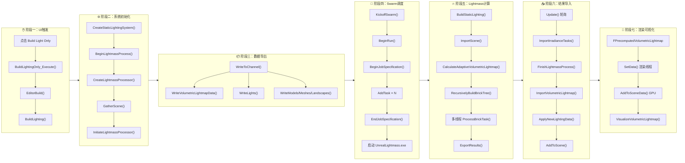

---

## 二、阶段一 & 二：从按钮到系统初始化

```mermaid
flowchart TD
    click["🖱️ 用户点击<br/>Build → Build Lighting Only"]
    click --> exec["FLevelEditorActionCallbacks<br/>::BuildLightingOnly_Execute()"]
    exec --> build["FEditorBuildUtils::EditorBuild()"]
    build --> lighting["UEditorEngine::BuildLighting()"]
    lighting --> manager["FStaticLightingManager<br/>::CreateStaticLightingSystem()"]

    manager --> sls["new FStaticLightingSystem()"]
    sls --> begin["BeginLightmassProcess()"]

    begin --> step1["① CreateLightmassProcessor()"]
    begin --> step2["② GatherScene()"]
    begin --> step3["③ InitiateLightmassProcessor()"]
    begin --> step4["④ KickoffSwarm()"]

    step1 --> init_swarm["FSwarmInterface::Initialize()"]
    step1 --> new_lmp["new FLightmassProcessor()"]
    new_lmp --> open_conn["Swarm.OpenConnection()"]
    new_lmp --> new_exp["new FLightmassExporter()"]

    step2 --> gather_lights["收集所有光源<br/>方向光/点光/聚光灯/矩形光"]
    step2 --> gather_geo["收集几何体<br/>StaticMesh/BSP/Landscape"]
    step2 --> gather_vlm["收集 VolumetricLightmap<br/>DensityVolume"]
    step2 --> gather_imp["收集 Importance Volume"]

    step3 --> write["FLightmassExporter<br/>::WriteToChannel()"]

    style click fill:#4CAF50,color:#fff
    style begin fill:#2196F3,color:#fff
    style step1 fill:#FF9800,color:#fff
    style step2 fill:#FF9800,color:#fff
    style step3 fill:#FF9800,color:#fff
    style step4 fill:#FF9800,color:#fff
```

**关键文件位置：**
| 类 | 文件 |
|---|---|
| `FLevelEditorActionCallbacks` | `Editor/LevelEditor/Private/LevelEditorActions.cpp` |
| `FEditorBuildUtils` | `Editor/UnrealEd/Private/EditorBuildUtils.cpp` |
| `UEditorEngine::BuildLighting` | `Editor/UnrealEd/Private/StaticLightingSystem/StaticLightingSystem.cpp` |
| `FStaticLightingSystem` | 同上 |
| `FLightmassProcessor` | `Editor/UnrealEd/Private/Lightmass/Lightmass.cpp` |
| `FLightmassExporter` | `Editor/UnrealEd/Private/Lightmass/LightmassExporter.cpp` |

---

## 三、阶段三：数据导出详细流程

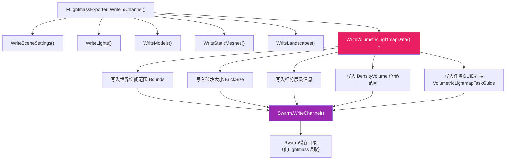

---

## 四、阶段四：Swarm任务调度流程

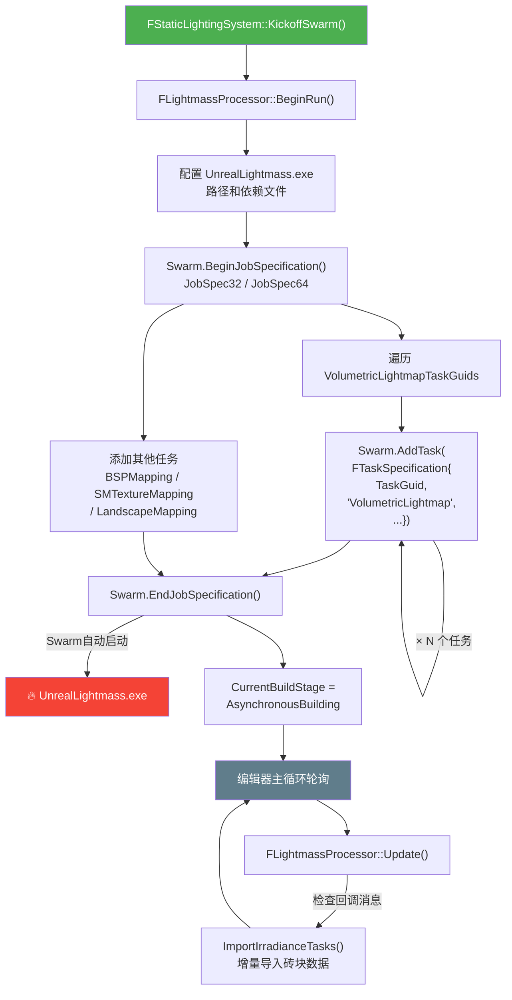

> **Debug Mode 分支**：如果 `bDebugMode=True`，则 `BeginRun()` 设置 `JOB_FLAG_MANUAL_START`，Swarm **不会**自动启动 Lightmass，需要手动从 VS 启动。

---

## 五、阶段五：Lightmass 计算核心流程

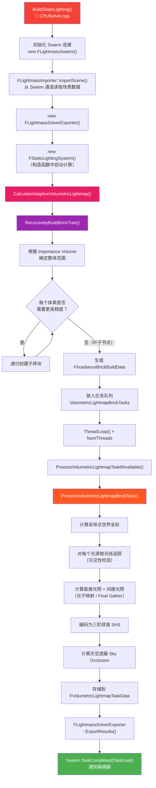

**关键文件位置：**
| 类/函数 | 文件 |
|---|---|
| `BuildStaticLighting()` | `Programs/UnrealLightmass/Private/CPUSolver/CPUSolver.cpp` |
| `CalculateAdaptiveVolumetricLightmap()` | `Programs/UnrealLightmass/Private/Lighting/AdaptiveVolumetricLightmap.cpp` |
| `RecursivelyBuildBrickTree()` | 同上 |
| `ProcessVolumetricLightmapBrickTask()` | 同上 |
| `bDebugVolumetricLightmapCell` | 同上（调试开关变量） |

---

## 六、阶段六：结果导入与应用流程

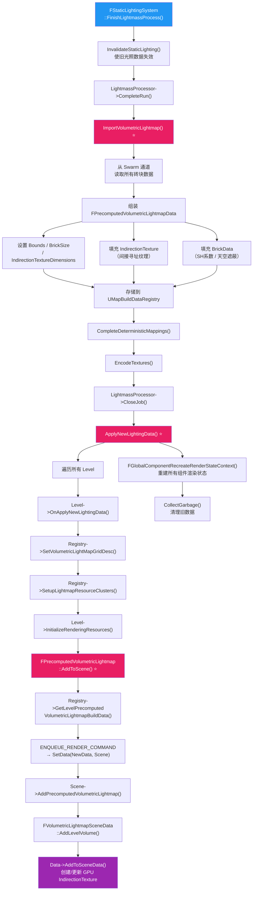

**关键文件位置：**
| 类/函数 | 文件 |
|---|---|
| `ImportVolumetricLightmap()` | `Editor/UnrealEd/Private/Lightmass/ImportVolumetricLightmap.cpp` |
| `FPrecomputedVolumetricLightmap` | `Runtime/Engine/Private/PrecomputedVolumetricLightmap.cpp` |
| `FPrecomputedVolumetricLightmapData` | 同上 |
| `FVolumetricLightmapSceneData` | `Runtime/Renderer/Private/VolumetricLightmapSceneData.cpp` |

---

## 七、编辑器端类关系图

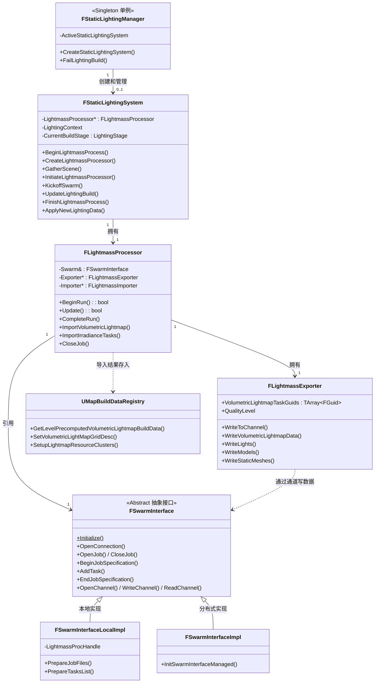

---

## 八、Lightmass 端类关系图

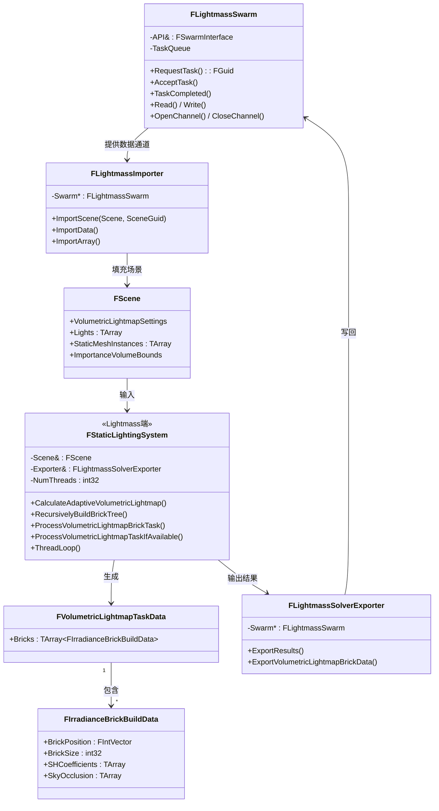

---

## 九、运行时渲染类关系图

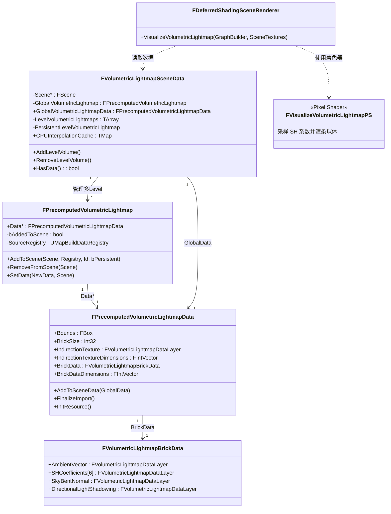

---

## 十、完整端到端时序图

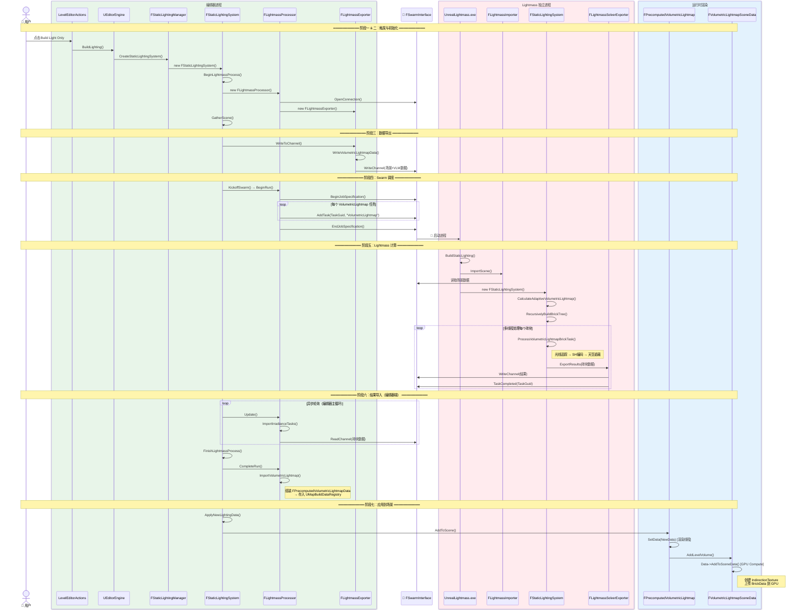

---

## 十一、自适应砖块树结构图

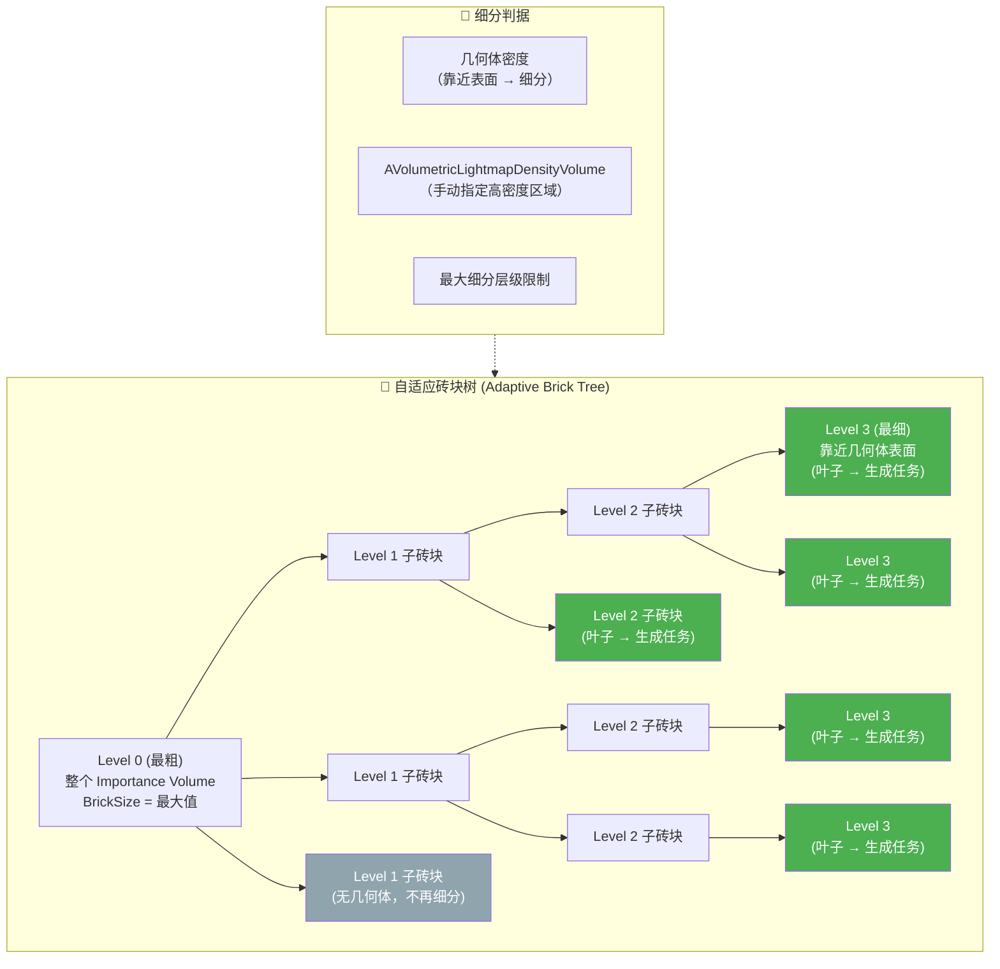

> 🟢 绿色 = 叶子节点，每个叶子生成一个 `FIrradianceBrickBuildData` 任务  
> ⬜ 灰色 = 不需要细分的区域（远离几何体）

---

## 十二、GPU 数据布局图

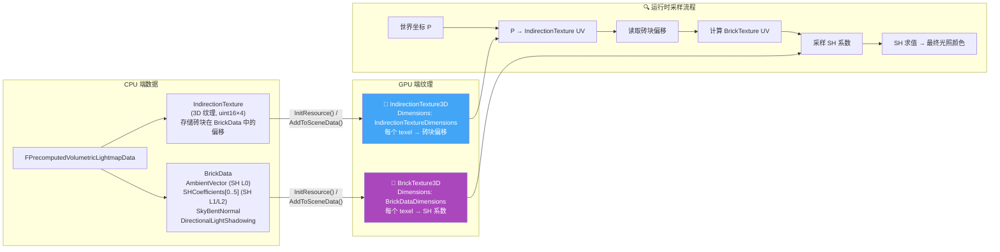

---

## 十三、调试断点速查图

```mermaid
flowchart TD
    subgraph EditorBreakpoints["🔴 编辑器端断点"]
        eb1["BeginLightmassProcess()<br/>📍 追踪构建触发"]
        eb2["WriteVolumetricLightmapData()<br/>📍 查看VLM数据导出"]
        eb3["BeginRun() 中 AddTask 处<br/>📍 查看Swarm任务提交"]
        eb4["ImportIrradianceTasks()<br/>📍 追踪增量导入"]
        eb5["ImportVolumetricLightmap()<br/>📍 追踪最终导入"]
        eb6["AddToScene()<br/>📍 数据应用到场景"]
        eb7["SetData()<br/>📍 渲染线程数据设置"]
        eb8["AddToSceneData()<br/>📍 GPU数据合并"]

        eb1 --> eb2 --> eb3 --> eb4 --> eb5 --> eb6 --> eb7 --> eb8
    end

    subgraph LightmassBreakpoints["🔵 Lightmass端断点"]
        lb1["BuildStaticLighting()<br/>📍 程序入口"]
        lb2["ImportScene()<br/>📍 场景导入"]
        lb3["CalculateAdaptiveVolumetricLightmap()<br/>📍 VLM计算入口"]
        lb4["RecursivelyBuildBrickTree()<br/>📍 砖块树构建"]
        lb5["ProcessVolumetricLightmapBrickTask()<br/>📍 单砖块计算"]
        lb6["bDebugVolumetricLightmapCell = true<br/>📍 调试特定单元格"]
        lb7["ExportResults()<br/>📍 结果导出"]

        lb1 --> lb2 --> lb3 --> lb4 --> lb5 --> lb6 --> lb7
    end

    subgraph DebugMethods["🛠️ 调试方法"]
        dm1["方法一：Debug Mode<br/>BaseLightmass.ini 设置<br/>bDebugMode=True<br/>手动从VS启动Lightmass"]
        dm2["方法二：Attach to Process<br/>正常Build后附加到<br/>UnrealLightmass.exe"]
        dm3["方法三：可视化<br/>Show → Visualize →<br/>Volumetric Lightmap"]
    end

    style eb1 fill:#F44336,color:#fff
    style eb5 fill:#F44336,color:#fff
    style eb6 fill:#F44336,color:#fff
    style lb3 fill:#2196F3,color:#fff
    style lb5 fill:#2196F3,color:#fff
    style dm1 fill:#FF9800,color:#fff
    style dm3 fill:#4CAF50,color:#fff
```

---

## 十四、可视化渲染管线

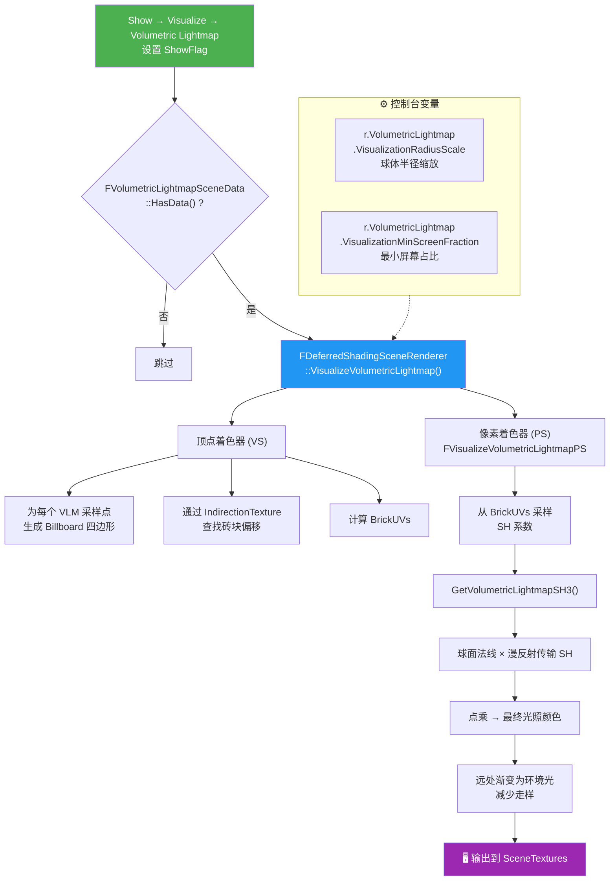

**着色器文件：** `Shaders/Private/VisualizeVolumetricLightmap.usf`

---

## 十五、关键日志与命令速查

| 类别 | 内容 |
|------|------|
| **编辑器日志** | `LogStaticLightingSystem` — 静态光照系统 |
| **编辑器日志** | `LogLightmassSolver` — Lightmass 处理器 |
| **Lightmass日志** | `LogLightmass` — Lightmass 进程 |
| **CVar** | `r.VolumetricLightmap.VisualizationRadiusScale` — 可视化球体半径 |
| **CVar** | `r.VolumetricLightmap.VisualizationMinScreenFraction` — 最小屏幕占比 |
| **统计** | `stat LightRendering` — 光照渲染统计 |
| **调试变量** | `bDebugVolumetricLightmapCell` — Lightmass 中的单元格调试开关 |
| **INI配置** | `BaseLightmass.ini` → `[DevOptions.StaticLighting]` → `bDebugMode=True` |

---

## 十六、一键导出插件方案（方案三：运行时读取）

> 本节对应之前讨论的**方案三**。该方案的核心思路是：**不修改引擎源码**，在编辑器运行时直接从已加载的 `FPrecomputedVolumetricLightmapData` 中读取 CPU 端数据并导出。

### 为什么选择方案三

| 维度 | 方案一（Build时介入） | 方案三（运行时读取）⭐ |
|------|----------------------|------------------------|
| **触发时机** | 必须在 Build Light 过程中执行 | **随时可以执行**，只要场景有已烘焙的 VLM 数据 |
| **侵入性** | 需要修改引擎 `ImportVolumetricLightmap()` 源码 | **可以做成纯插件**，不改引擎代码 |
| **用户体验** | 用户必须重新 Build Light 才能导出 | **一键导出**，打开任何已烘焙的场景直接导出 |
| **数据可用性** | 仅 Build 时一次性可用 | 编辑器模式下 CPU 数据始终保留 |
| **部署方式** | 改引擎源码，升级引擎时需要维护 | **独立插件**，引擎升级无影响 |

### 关键保障：编辑器模式下 CPU 数据始终可用

在 `PrecomputedVolumetricLightmap.cpp` 的 `SetData()` 中：

```cpp
Data->IndirectionTexture.bNeedsCPUAccess = GIsEditor;
Data->BrickData.SetNeedsCPUAccess(GIsEditor);
```

当 `bNeedsCPUAccess = true` 时，`FVolumetricLightmapDataLayer::Discard()` 不会释放 CPU 端的 `TArray<uint8> Data`，因此编辑器模式下 CPU 数据在 GPU 上传后依然保留。

### 插件实现流程图

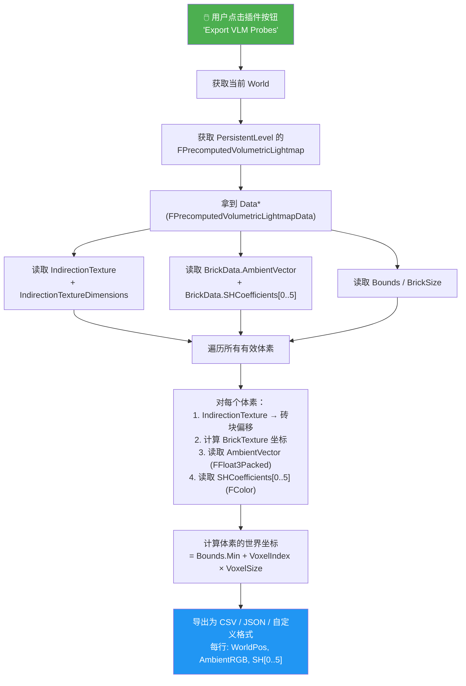

### 数据访问路径

```cpp
// 在插件中获取数据的关键路径：
UWorld* World = GEditor->GetEditorWorldContext().World();
ULevel* Level = World->PersistentLevel;
FPrecomputedVolumetricLightmap* VLM = Level->PrecomputedVolumetricLightmap;
FPrecomputedVolumetricLightmapData* Data = VLM->Data;

// 然后就可以访问：
// Data->BrickData.AmbientVector.Data        → TArray<uint8>，内部是 FFloat3Packed
// Data->BrickData.SHCoefficients[i].Data    → TArray<uint8>，内部是 FColor (RGBA8)
// Data->IndirectionTexture.Data             → TArray<uint8>，间接寻址表
// Data->Bounds                              → 世界空间范围
// Data->BrickSize                           → 砖块大小（每个砖块的体素数，如 4）
// Data->IndirectionTextureDimensions        → 间接纹理维度
// Data->BrickDataDimensions                 → 砖块数据纹理维度
```

---

## 十七、烘焙数据从 UAsset 加载到 GPU 的完整流程

> 本节详细说明烘焙好的 Volumetric Lightmap 数据**存储在哪里**、**如何从磁盘加载到内存**、**何时上传到 GPU 纹理**。

### 17.1 数据存储位置

烘焙完成后，VLM 数据存储在 `UMapBuildDataRegistry` 这个 UObject 中，它是一个**独立的 uasset 文件**，通常位于：

```
Content/<MapName>_BuiltData.uasset
```

`UMapBuildDataRegistry` 内部用一个 `TMap` 来存储每个 Level 的 VLM 数据：

```cpp
// MapBuildDataRegistry.h
class UMapBuildDataRegistry : public UObject
{
    // ...
    TMap<FGuid, FPrecomputedVolumetricLightmapData*> LevelPrecomputedVolumetricLightmapBuildData;
    FVolumetricLightMapGridDesc* VolumetricLightMapGridDesc; // World Partition 用
};
```

每个 `FPrecomputedVolumetricLightmapData` 包含完整的 VLM 数据（IndirectionTexture + BrickData）。

### 17.2 完整加载流程图

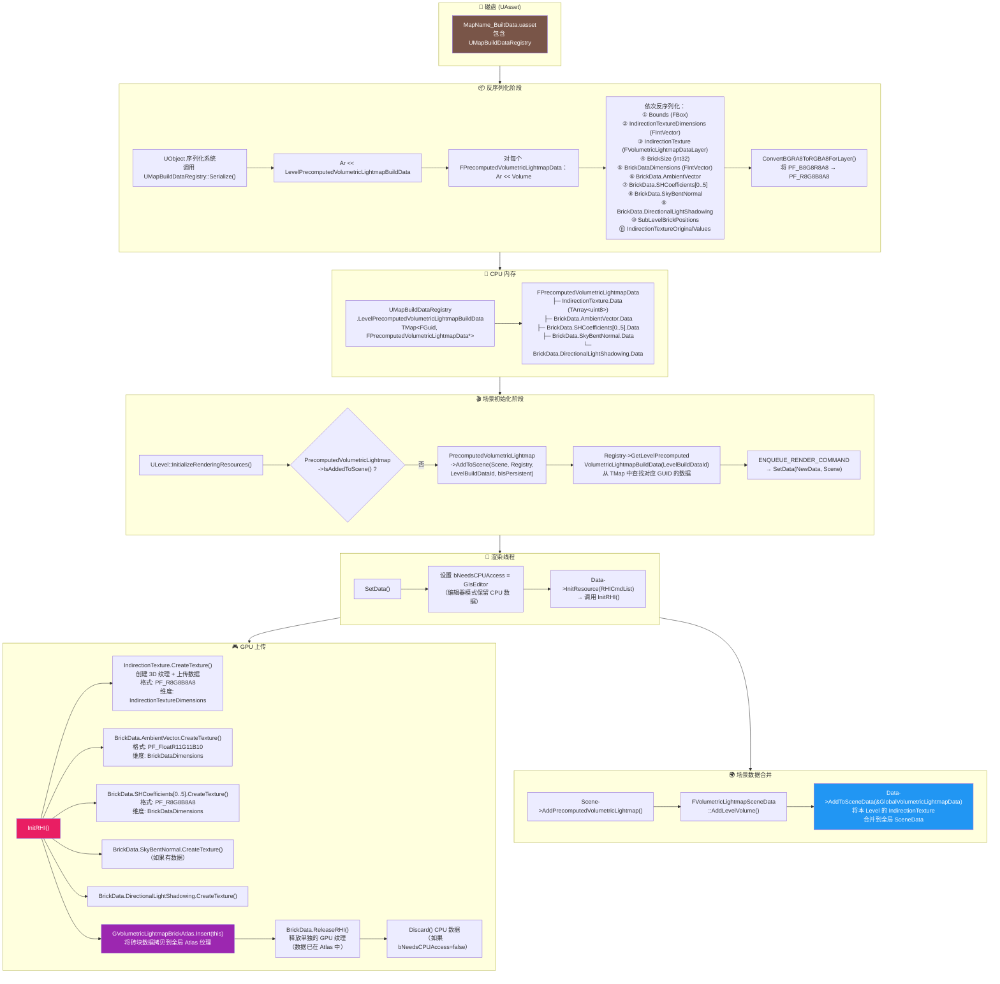

### 17.3 关键函数调用链时序图

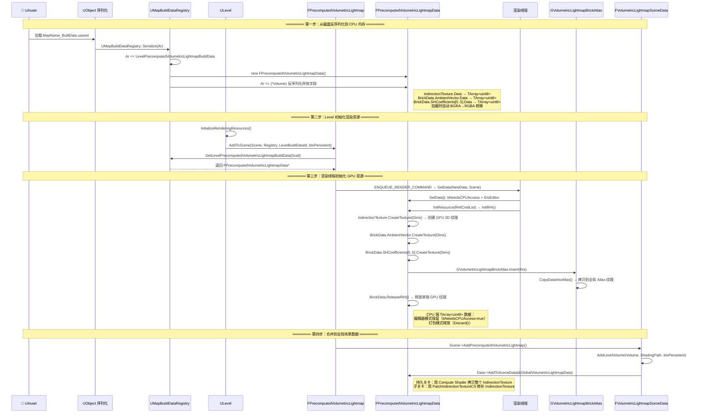

### 17.4 数据存储位置速查表

| 阶段 | 数据位置 | 格式 | 生命周期 |
|------|---------|------|---------|
| **磁盘** | `MapName_BuiltData.uasset` 中的 `UMapBuildDataRegistry` | 二进制序列化 | 永久 |
| **CPU 内存** | `UMapBuildDataRegistry.LevelPrecomputedVolumetricLightmapBuildData[Guid]` → `FPrecomputedVolumetricLightmapData` | `TArray<uint8>` | 编辑器模式：始终保留<br/>打包模式：GPU 上传后释放 |
| **GPU 单独纹理** | `FPrecomputedVolumetricLightmapData.BrickData.*.Texture` | RHI 3D Texture | 临时，拷贝到 Atlas 后释放 |
| **GPU Atlas** | `GVolumetricLightmapBrickAtlas.TextureSet` | RHI 3D Texture (全局) | 场景存在期间 |
| **GPU IndirectionTexture** | `GlobalVolumetricLightmapData.IndirectionTexture.Texture` | RHI 3D Texture (全局) | 场景存在期间 |
| **场景引用** | `FScene.VolumetricLightmapSceneData.GlobalVolumetricLightmapData` | 指针 | 场景存在期间 |

---

## 十八、IndirectionTexture 与 BrickTexture 的映射计算方式

> 本节详细说明 Volumetric Lightmap 的**两级寻址机制**：从世界坐标到最终 SH 系数的完整计算过程。

### 18.1 核心概念

Volumetric Lightmap 使用**两级间接寻址**来高效存储自适应精度的光照数据：

```
世界坐标 P → IndirectionTexture（粗粒度，均匀网格）→ BrickTexture（细粒度，自适应）→ SH 系数
```

- **IndirectionTexture**：一个均匀的 3D 纹理，覆盖整个 Importance Volume。每个 texel 存储 4 字节 (R8G8B8A8)，指向 BrickTexture 中的砖块位置。
- **BrickTexture**：一个紧凑的 3D 纹理 Atlas，存储所有砖块的实际光照数据（AmbientVector、SHCoefficients 等）。

### 18.2 IndirectionTexture 的 Texel 格式

每个 IndirectionTexture texel 是 4 字节 `uint8[4]`：

| 字节 | 含义 |
|------|------|
| `[0]` (R) | `IndirectionBrickOffset.X` — 砖块在 BrickTexture 布局中的 X 位置 |
| `[1]` (G) | `IndirectionBrickOffset.Y` — 砖块在 BrickTexture 布局中的 Y 位置 |
| `[2]` (B) | `IndirectionBrickOffset.Z` — 砖块在 BrickTexture 布局中的 Z 位置 |
| `[3]` (A) | `IndirectionBrickSize` — 该砖块在 IndirectionTexture 中覆盖的格子数（0 = 无数据） |

### 18.3 完整映射计算流程图

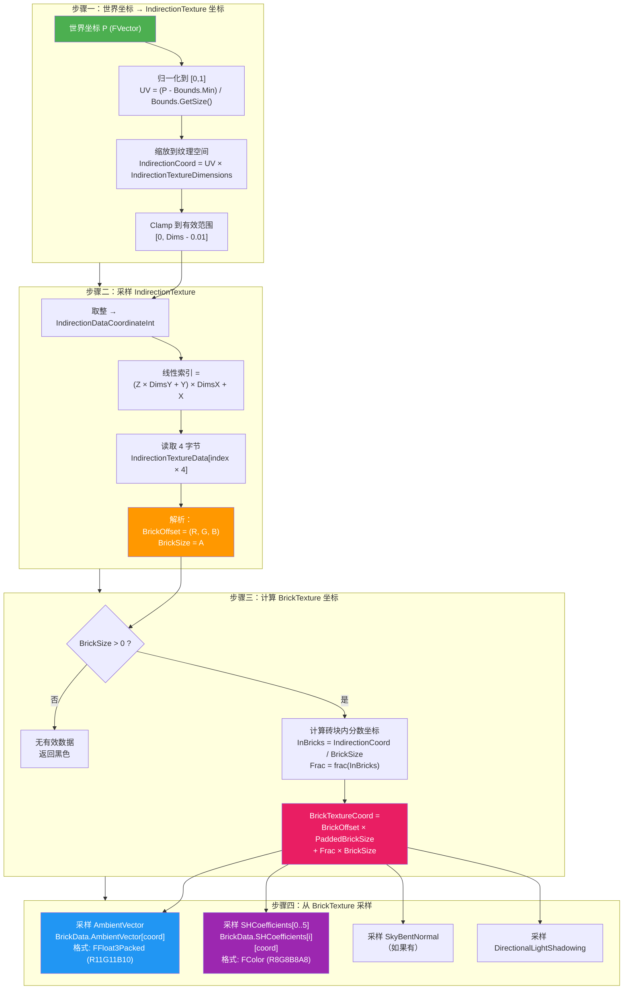

### 18.4 三个关键函数的代码解析

#### ① `ComputeIndirectionCoordinate()` — 世界坐标 → IndirectionTexture 坐标

```cpp
// 📍 PrecomputedVolumetricLightmap.cpp
FVector ComputeIndirectionCoordinate(
    FVector LookupPosition,
    const FBox& VolumeBounds,
    FIntVector IndirectionTextureDimensions)
{
    // 计算世界空间到 UV 空间的变换
    const FVector InvVolumeSize = FVector(1.0f) / VolumeBounds.GetSize();
    const FVector VolumeWorldToUVScale = InvVolumeSize;
    const FVector VolumeWorldToUVAdd = -VolumeBounds.Min * InvVolumeSize;

    // 变换到 IndirectionTexture 的纹素坐标
    FVector IndirectionCoord = (LookupPosition * VolumeWorldToUVScale + VolumeWorldToUVAdd)
                             * FVector(IndirectionTextureDimensions);

    // Clamp 到有效范围
    IndirectionCoord.X = FMath::Clamp(IndirectionCoord.X, 0.0f, IndirectionTextureDimensions.X - .01f);
    IndirectionCoord.Y = FMath::Clamp(IndirectionCoord.Y, 0.0f, IndirectionTextureDimensions.Y - .01f);
    IndirectionCoord.Z = FMath::Clamp(IndirectionCoord.Z, 0.0f, IndirectionTextureDimensions.Z - .01f);

    return IndirectionCoord;
}
```

**数学公式**：`IndirectionCoord = ((P - Bounds.Min) / Bounds.Size) × IndirectionTextureDimensions`

#### ② `SampleIndirectionTexture()` — 从 IndirectionTexture 读取砖块偏移

```cpp
// 📍 PrecomputedVolumetricLightmap.cpp
void SampleIndirectionTexture(
    FVector IndirectionDataSourceCoordinate,
    FIntVector IndirectionTextureDimensions,
    const uint8* IndirectionTextureData,
    FIntVector& OutIndirectionBrickOffset,
    int32& OutIndirectionBrickSize)
{
    // 取整得到整数坐标
    FIntVector IndirectionDataCoordinateInt(IndirectionDataSourceCoordinate);
    // Clamp
    IndirectionDataCoordinateInt.X = FMath::Clamp(IndirectionDataCoordinateInt.X, 0, IndirectionTextureDimensions.X - 1);
    IndirectionDataCoordinateInt.Y = FMath::Clamp(IndirectionDataCoordinateInt.Y, 0, IndirectionTextureDimensions.Y - 1);
    IndirectionDataCoordinateInt.Z = FMath::Clamp(IndirectionDataCoordinateInt.Z, 0, IndirectionTextureDimensions.Z - 1);

    // 计算线性索引（Z-major 排列）
    const int32 IndirectionDataIndex =
        ((IndirectionDataCoordinateInt.Z * IndirectionTextureDimensions.Y)
        + IndirectionDataCoordinateInt.Y) * IndirectionTextureDimensions.X
        + IndirectionDataCoordinateInt.X;

    // 读取 4 字节：[R=OffsetX, G=OffsetY, B=OffsetZ, A=BrickSize]
    const uint8* IndirectionVoxelPtr = &IndirectionTextureData[IndirectionDataIndex * 4];
    OutIndirectionBrickOffset = FIntVector(
        *(IndirectionVoxelPtr + 0),   // R → BrickOffset.X
        *(IndirectionVoxelPtr + 1),   // G → BrickOffset.Y
        *(IndirectionVoxelPtr + 2));  // B → BrickOffset.Z
    OutIndirectionBrickSize = *(IndirectionVoxelPtr + 3);  // A → BrickSize
}
```

#### ③ `ComputeBrickTextureCoordinate()` — IndirectionTexture 坐标 → BrickTexture 坐标

```cpp
// 📍 PrecomputedVolumetricLightmap.cpp
FVector ComputeBrickTextureCoordinate(
    FVector IndirectionDataSourceCoordinate,
    FIntVector IndirectionBrickOffset,
    int32 IndirectionBrickSize,
    int32 BrickSize)
{
    // 将 IndirectionTexture 坐标转换为"以砖块为单位"的坐标
    FVector IndirectionCoordInBricks = IndirectionDataSourceCoordinate / IndirectionBrickSize;

    // 取小数部分 → 砖块内的归一化位置 [0, 1)
    FVector FractionalCoord(
        FMath::Frac(IndirectionCoordInBricks.X),
        FMath::Frac(IndirectionCoordInBricks.Y),
        FMath::Frac(IndirectionCoordInBricks.Z));

    // PaddedBrickSize = BrickSize + 1（每个砖块有 1 个 texel 的 padding 用于三线性插值）
    int32 PaddedBrickSize = BrickSize + 1;

    // 最终 BrickTexture 坐标 = 砖块起始位置 + 砖块内偏移
    FVector BrickTextureCoordinate =
        FVector(IndirectionBrickOffset * PaddedBrickSize)  // 砖块在 Atlas 中的起始 texel
        + FractionalCoord * BrickSize;                      // 砖块内的偏移

    return BrickTextureCoordinate;
}
```

### 18.5 映射计算数学公式总结

```
给定：
  P           = 世界坐标
  Bounds      = VLM 覆盖的世界空间包围盒
  IndDims     = IndirectionTextureDimensions (如 64×64×32)
  BrickSize   = 每个砖块的体素数 (如 4)
  PaddedSize  = BrickSize + 1 = 5

步骤一：世界坐标 → IndirectionTexture 坐标
  IndCoord = ((P - Bounds.Min) / Bounds.Size) × IndDims

步骤二：采样 IndirectionTexture
  IntCoord = floor(IndCoord)
  LinearIndex = (IntCoord.Z × IndDims.Y + IntCoord.Y) × IndDims.X + IntCoord.X
  [R, G, B, A] = IndirectionTextureData[LinearIndex × 4 .. +3]
  BrickOffset = (R, G, B)    // 砖块在 BrickTexture 布局中的位置
  IndBrickSize = A            // 该砖块覆盖的 IndirectionTexture 格子数

步骤三：计算 BrickTexture 坐标
  CoordInBricks = IndCoord / IndBrickSize
  FracCoord = frac(CoordInBricks)
  BrickTexCoord = BrickOffset × PaddedSize + FracCoord × BrickSize

步骤四：从 BrickTexture 线性索引读取数据
  LinearBrickIndex = (BrickTexCoord.Z × BrickDataDims.Y + BrickTexCoord.Y)
                   × BrickDataDims.X + BrickTexCoord.X
  AmbientValue = AmbientVector.Data[LinearBrickIndex]        // FFloat3Packed
  SHValue[i]   = SHCoefficients[i].Data[LinearBrickIndex]    // FColor (RGBA8)
```

### 18.6 可视化示意图：两级寻址

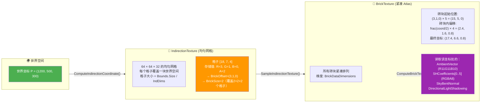

### 18.7 PaddedBrickSize 的作用

每个砖块在 BrickTexture 中占据 `(BrickSize + 1)³` 个 texel，而不是 `BrickSize³`。多出的 1 个 texel 是**边界 padding**，用于 GPU 三线性插值时避免采样到相邻砖块的数据：

```
BrickSize = 4 的砖块在 Atlas 中的布局：

  ┌─────────────┐
  │ 0 1 2 3 │ 4 │  ← 第 4 个 texel 是 padding（复制自相邻砖块或边界值）
  │ 有效数据  │pad│
  └─────────────┘
  实际占用 5 个 texel (PaddedBrickSize = 5)
```

### 18.8 关键文件位置

| 函数/类 | 文件 |
|---------|------|
| `ComputeIndirectionCoordinate()` | `Runtime/Engine/Private/PrecomputedVolumetricLightmap.cpp` |
| `SampleIndirectionTexture()` | 同上 |
| `ComputeBrickTextureCoordinate()` | 同上 |
| `FPrecomputedVolumetricLightmapData::InitRHI()` | 同上（GPU 纹理创建） |
| `FPrecomputedVolumetricLightmapData::AddToSceneData()` | 同上（场景数据合并） |
| `GVolumetricLightmapBrickAtlas` | 同上（全局 Atlas 管理） |
| `FVolumetricLightmapSceneData::AddLevelVolume()` | `Runtime/Renderer/Private/RendererScene.cpp` |
| `UMapBuildDataRegistry::Serialize()` | `Runtime/Engine/Private/MapBuildData.cpp` |
| `operator<<(FArchive&, FPrecomputedVolumetricLightmapData&)` | `Runtime/Engine/Private/PrecomputedVolumetricLightmap.cpp` |
