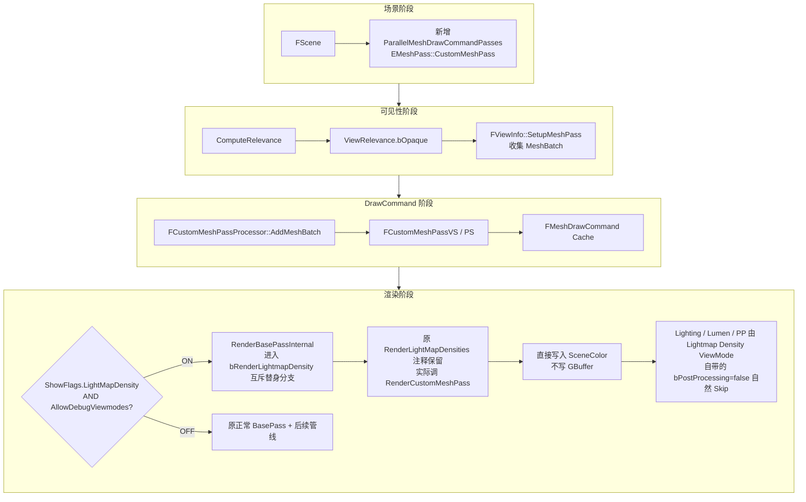
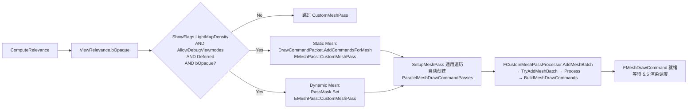
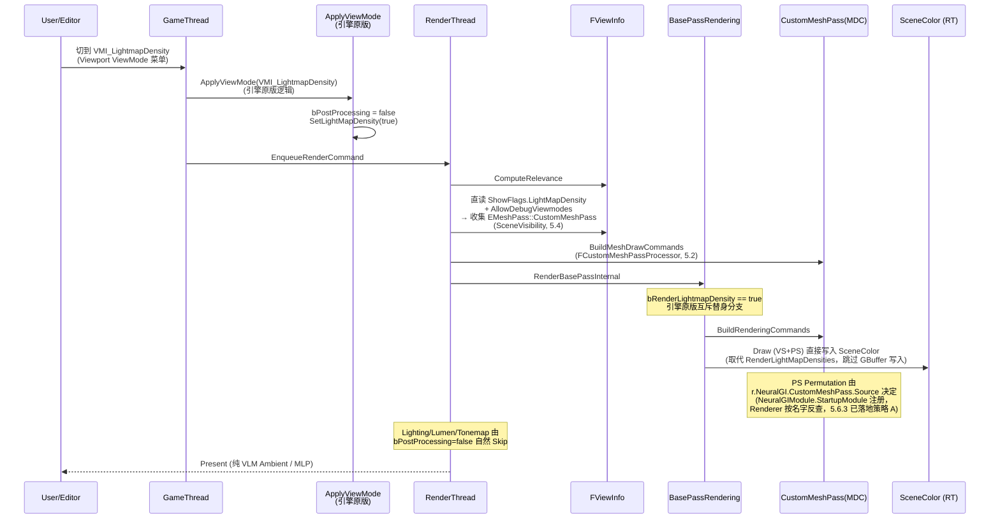

# CustomMeshPass 设计文档

> 项目：NeuralGI
> 目标：新增一个独立的 Mesh Pass（`CustomMeshPass`），用于**只显示当前场景 Volumetric Lightmap（VLM）的 Ambient 值**，作为 NeuralGI 项目中 VLM / MLP 推理结果的可视化基础设施。
> 版本：v0.6.1（在 v0.6 基础上修正 5.6.3 —— 经验证 `CustomMeshPass` 注册时仅设 `EMeshPassFlags::MainView`，**未启用 `CachedMeshCommands`**，因此**静态网格也不走 MeshDrawCommand cache**，CVar `r.NeuralGI.CustomMeshPass.Source` 翻转对静态 / 动态网格均即时生效；策略 A 不存在

---

## 1. 背景与动机

### 1.1 背景
- NeuralGI 项目使用神经网络（MLP）来压缩 / 还原 Volumetric Lightmap（VLM）中的 SH 系数，核心数据源是 VLM 的 `AmbientVector`（SH L0 项）与 `SHCoefficients0~5`。
- 调试、对比"原始 VLM Ambient vs MLP 重建 Ambient"时，需要一种能够**剥离所有直接光照、材质 BaseColor、后处理影响**的可视化视图。
- 现有 ViewMode（如 `VMI_VisualizeVolumetricLightmap`）要么受材质/后处理干扰，要么输出的是 Probe Marker 而非逐像素 Ambient，不满足需求。

### 1.2 动机
需要一个**干净、独立、可扩展**的 Mesh Pass：
1. 按场景中所有可接收 VLM 的不透明 Mesh 执行绘制；
2. 逐像素采样 VLM Ambient（后续可扩展到采样 MLP 推理结果）；
3. 输出到 SceneColor，直接呈现到屏幕，不受 Lighting / PostProcess 干扰；
4. **入口复用**：直接借用编辑器 *Lightmap Density* ViewMode 作为开关，零侵入，不新增 ViewMode / ShowFlag。

---

## 2. 设计目标

| 编号 | 目标 | 优先级 |
|---|---|---|
| G1 | 新增一个 `EMeshPass::CustomMeshPass` 枚举，完整挂载到 `FScene::ParallelMeshDrawCommandPasses` 体系 | P0 |
| G2 | 提供独立的 `FCustomMeshPassProcessor`，只收集不透明 / Masked、支持 VLM 的 Primitive | P0 |
| G3 | 提供独立的 `VS/PS`（`CustomMeshPass.usf`），输出逐像素 VLM Ambient | P0 |
| G4 | **复用 LightMap Density 入口**：启用与否的【唯一信源】= `EngineShowFlags.LightMapDensity && AllowDebugViewmodes()`；不新增任何 ViewMode / ShowFlag | P0 |
| G5 | 在 `RenderBasePassInternal` 内**取代** `RenderLightMapDensities` 调用：原调用以注释保留，下方紧跟 `RenderCustomMeshPass`；连 GBuffer 写入也跳过 | P0 |
| G6 | 复用 `Lightmap Density` ViewMode 自带的画面纯净化（`bPostProcessing = false` + `bDoParallelBasePass` 关闭），无需任何 `EngineShowFlagOverride` 改动 | P1 |
| G7 | 提供 CVar `r.NeuralGI.CustomMeshPass.Source` 控制 Shader 变体（VLM Ambient ↔ MLP 推理）；CVar 由 `NeuralGIModule` 插件 `StartupModule` 注册，Renderer 模块按名字反查消费 | P2 ✅ 已落地（策略 A） |
| G8 | 第一期只支持 Desktop / SM5 以上；移动端留作后续扩展 | P2 |

---

## 3. 非目标

- 不处理**半透明 / 头发 / 水体**等特殊 Shading Model。
- 不生成材质编辑器资产（不依赖用户自定义 Material）。
- 第一期不考虑 Nanite 路径（后续评估）。
- 不做 HDR → LDR 色调映射；输出即最终颜色。
- 不新增任何 `EViewModeIndex` / `FEngineShowFlags` 字段。

---

## 4. 总体架构



---

## 5. 详细设计

### 5.1 新增 MeshPass 枚举

**文件**：`Engine/Source/Runtime/Renderer/Public/MeshPassProcessor.h`

```cpp
enum class EMeshPass : uint8
{
    DepthPass,
    SecondaryDepthPass,
    BasePass,
    // ... 省略 ...
    VirtualTextureMarkPass,

    CustomMeshPass,   // ← 新增，放在 Num 之前

    Num,
    NumBits = 6,
};
```

**同时修改**：
1. `MeshPassProcessor.cpp` 中 `GetMeshPassName(EMeshPass)` 增加 `case EMeshPass::CustomMeshPass: return TEXT("CustomMeshPass");`
2. 使用 `FRegisterPassProcessorCreateFunction` 把我们的 Processor 注册到全局表中。

> **风险点**：新增枚举会让 `FMeshDrawCommand` 缓存失效，第一次启动有一次性卡顿。可接受。

---

### 5.2 MeshPassProcessor

**文件**：`Engine/Source/Runtime/Renderer/Private/CustomMeshPassRendering.cpp`

```cpp
class FCustomMeshPassProcessor : public FSceneRenderingAllocatorObject<FCustomMeshPassProcessor>,
                                 public FMeshPassProcessor
{
public:
    FCustomMeshPassProcessor(
        EMeshPass::Type InMeshPassType,
        const FScene* InScene,
        ERHIFeatureLevel::Type InFeatureLevel,
        const FSceneView* InView,
        FMeshPassDrawListContext* InDrawListContext);

    virtual void AddMeshBatch(
        const FMeshBatch& MeshBatch,
        uint64 BatchElementMask,
        const FPrimitiveSceneProxy* PrimitiveSceneProxy,
        int32 StaticMeshId = -1) override;

private:
    template <typename LightMapPolicyType>
    bool Process(...);

    FMeshPassProcessorRenderState PassDrawRenderState;
};
```

**关键点**：
| 要素 | 选择 |
|---|---|
| 允许的 BlendMode | `BLEND_Opaque` / `BLEND_Masked` |
| RasterizerState | `CullMode_Back`（复用 BasePass） |
| DepthStencilState | `TStaticDepthStencilState<false, CF_Equal>`（与 BasePass 一致：依赖前序 DepthPass 的 Depth，关闭 DepthWrite） |
| BlendState | `TStaticBlendState<CW_RGB>` |
| LightMapPolicy | `FUniformLightMapPolicy(LMP_PRECOMPUTED_IRRADIANCE_VOLUME_INDIRECT_LIGHTING)`，强制走 VLM 路径 |
| Nanite | 一期不支持；后续单独提 `FCustomMeshPassNaniteCommandBuilder` |

**过滤规则**（在 `AddMeshBatch` 中）：
1. `Material.GetBlendMode()` ∈ {Opaque, Masked}
2. `PrimitiveSceneProxy->IsIndirectLightingCacheAllowed()` 或 `ShouldUseVolumetricLightmap`
3. Shading Model 为 `MSM_DefaultLit` / `MSM_Subsurface` / `MSM_PreintegratedSkin` 等常规型

---

### 5.3 Shader

**文件**：`Engine/Shaders/Private/CustomMeshPass.usf`

```hlsl
#include "/Engine/Private/Common.ush"
#include "/Engine/Private/VolumetricLightmapShared.ush"
#include "/Engine/Private/VertexFactoryCommon.ush"

// -----------------------------
// Vertex Shader
// -----------------------------
struct FCustomMeshPassVSToPS
{
    float4 Position        : SV_POSITION;
    float3 WorldPosition   : TEXCOORD0;
};

void MainVS(
    FVertexFactoryInput Input,
    out FCustomMeshPassVSToPS Output)
{
    ResolvedView = ResolveView();
    FVertexFactoryIntermediates VFIntermediates = GetVertexFactoryIntermediates(Input);
    float4 WorldPos = VertexFactoryGetWorldPosition(Input, VFIntermediates);

    Output.WorldPosition = WorldPos.xyz;
    Output.Position      = mul(WorldPos, ResolvedView.TranslatedWorldToClip);
}

// -----------------------------
// Pixel Shader
// -----------------------------
#define CUSTOM_MESH_PASS_SOURCE_VLM_AMBIENT    0
#define CUSTOM_MESH_PASS_SOURCE_MLP_INFERENCE  1

void MainPS(
    FCustomMeshPassVSToPS In,
    out float4 OutColor : SV_Target0)
{
#if CUSTOM_MESH_PASS_SOURCE == CUSTOM_MESH_PASS_SOURCE_VLM_AMBIENT
    float3 Ambient = GetVolumetricLightmapSH0(In.WorldPosition).rgb;
#elif CUSTOM_MESH_PASS_SOURCE == CUSTOM_MESH_PASS_SOURCE_MLP_INFERENCE
    float3 Ambient = SampleNeuralGIMlpAmbient(In.WorldPosition);
#endif

    OutColor = float4(Ambient, 1.0);
}
```

**C++ 侧 Shader 声明**：
```cpp
class FCustomMeshPassVS : public FMeshMaterialShader { DECLARE_SHADER_TYPE(...); };
class FCustomMeshPassPS : public FMeshMaterialShader
{
    DECLARE_SHADER_TYPE(FCustomMeshPassPS, MeshMaterial);
    class FSourceDim : SHADER_PERMUTATION_INT("CUSTOM_MESH_PASS_SOURCE", 2);
    using FPermutationDomain = TShaderPermutationDomain<FSourceDim>;
    ...
};

IMPLEMENT_MATERIAL_SHADER_TYPE(, FCustomMeshPassVS, TEXT("/Engine/Private/CustomMeshPass.usf"), TEXT("MainVS"), SF_Vertex);
IMPLEMENT_MATERIAL_SHADER_TYPE(, FCustomMeshPassPS, TEXT("/Engine/Private/CustomMeshPass.usf"), TEXT("MainPS"), SF_Pixel);
```

`ShouldCompilePermutation` 中限制：
- `Parameters.MaterialParameters.ShadingModels` 包含 `MSM_DefaultLit` 即可；
- `Parameters.MaterialParameters.BlendMode` ∈ {Opaque, Masked}；
- `IsFeatureLevelSupported(Parameters.Platform, ERHIFeatureLevel::SM5)`。

---

### 5.4 场景收集 & 可见性

#### 5.4.1 触发条件 —— 复用 `ShowFlags.LightMapDensity`

**文件**：`Engine/Source/Runtime/Renderer/Private/SceneVisibility.cpp`

```cpp
// NeuralGI CustomMeshPass：启用与否的【唯一信源】 = EngineShowFlags.LightMapDensity（复用 Lightmap Density ViewMode 入口）。
// 设计上：CustomMeshPass 直接替换原 LightMapDensity 路径，复用其可见性收集 / BasePass 互斥替身 / EngineShowFlagOverride 画面净化。
// 进入条件与引擎原 LightMapDensity 完全对齐：需 AllowDebugViewmodes() 为真。
// （Shader 变体切换由 r.NeuralGI.CustomMeshPass.Source 控制，与启用与否正交。）
static FORCEINLINE bool IsNeuralGICustomMeshPassEnabled(const FEngineShowFlags& ShowFlags)
{
    return ShowFlags.LightMapDensity && AllowDebugViewmodes();
}
```

**进入 CustomMeshPass 收集** ⇔
```
ShowFlags.LightMapDensity == 1                 // 单一信源（复用 LightMap Density ViewMode）
AND AllowDebugViewmodes()                      // 与 LightMapDensity 引擎判定完全对齐
AND ShadingPath == EShadingPath::Deferred      // 与 5.2 Processor 注册路径一致
AND ViewRelevance.bDrawRelevance               // 静/动态收集分支天然前置
AND ViewRelevance.bRenderInMainPass            // 静/动态收集分支天然前置
AND ViewRelevance.bOpaque                      // FMaterialRelevance.bOpaque 已涵盖 Opaque/Masked
```

#### 5.4.2 静态网格 DrawCommand 收集
**文件**：`Engine/Source/Runtime/Renderer/Private/SceneVisibility.cpp`
**位置**：静态网格收集块内，紧跟 `EMeshPass::AnisotropyPass` 之后、`EMeshPass::CustomDepth` 之前。

```cpp
if (StaticMeshRelevance.bUseAnisotropy)
{
    DrawCommandPacket.AddCommandsForMesh(..., EMeshPass::AnisotropyPass);
}

// NeuralGI CustomMeshPass：仅在 ShowFlag 启用 + Deferred + 不透明（Opaque/Masked）通道时收集。
if (IsNeuralGICustomMeshPassEnabled(View.Family->EngineShowFlags)
    && ShadingPath == EShadingPath::Deferred
    && ViewRelevance.bOpaque)
{
    DrawCommandPacket.AddCommandsForMesh(
        PrimitiveIndex, PrimitiveSceneInfo, StaticMeshRelevance, StaticMesh,
        CullingPayloadFlags, Scene, bCanCache, EMeshPass::CustomMeshPass);
}

if (ViewRelevance.bRenderCustomDepth && bRenderCustomDepth) { ... }
```

#### 5.4.3 动态网格 PassMask 设置
**文件**：`Engine/Source/Runtime/Renderer/Private/SceneVisibility.cpp` → `ComputeDynamicMeshRelevance`
**位置**：紧跟 `bUsesAnisotropy` 之后、`Mobile/CSM` 分支之前。

```cpp
if (ViewRelevance.bUsesAnisotropy)
{
    PassMask.Set(EMeshPass::AnisotropyPass);
    View.NumVisibleDynamicMeshElements[EMeshPass::AnisotropyPass] += NumElements;
}

// NeuralGI CustomMeshPass（动态网格分支）：与静态网格保持一致。
if (IsNeuralGICustomMeshPassEnabled(View.Family->EngineShowFlags)
    && ShadingPath == EShadingPath::Deferred
    && ViewRelevance.bOpaque)
{
    PassMask.Set(EMeshPass::CustomMeshPass);
    View.NumVisibleDynamicMeshElements[EMeshPass::CustomMeshPass] += NumElements;
}

if (ShadingPath == EShadingPath::Mobile) { ... }
```

#### 5.4.4 SetupMeshPass —— 无需改动

`SetupMeshPass` 是**通用循环**，只要满足以下三件事（已在 5.1 / 5.2 完成），引擎会**自动**为我们的 Pass 创建并 Dispatch：
1. `EMeshPass::CustomMeshPass` 已注册到枚举（5.1）；
2. `FCustomMeshPassProcessor` 工厂以 `EShadingPath::Deferred` 注册（5.2）；
3. PassFlags 含 `EMeshPassFlags::MainView`（5.2 的 `REGISTER_MESHPASSPROCESSOR_AND_PSOCOLLECTOR` 中已声明）。

#### 5.4.5 与 Processor / Shader 三层一致性

| 层 | 过滤位置 | 关键条件 |
|---|---|---|
| **可见性收集**（5.4） | `SceneVisibility.cpp` | `ShowFlags.LightMapDensity && AllowDebugViewmodes()` + `Deferred` + `bOpaque` |
| **MeshDrawCommand 构建**（5.2） | `FCustomMeshPassProcessor::TryAddMeshBatch` | `!IsTranslucent` + `IsLit` + `ShouldIncludeMaterialInDefaultOpaquePass` |
| **Shader 编译**（5.3） | `FCustomMeshPassVS/PS::ShouldCompilePermutation` | `MD_Surface` + Opaque/Masked + Lit + SM5+ |

#### 5.4.6 数据流（实际落地版）



#### 5.4.7 验证

| ViewMode | `ShowFlags.LightMapDensity` | 行为 |
|---|---|---|
| `VMI_Lit` / `VMI_Unlit` 等默认 | 0 | 完全不收集 CustomMeshPass DrawCommand；零差异 |
| `VMI_LightmapDensity`（编辑器 Viewport → ViewMode → *Lightmap Density*） | 1 | 所有 Opaque/Masked Lit 静/动态网格进入 CustomMeshPass，DrawCommand 已构建；BasePass 内 `bRenderLightmapDensity` 互斥替身分支调用 `RenderCustomMeshPass`（5.5）取代原 `RenderLightMapDensities` |

> **注意**：Lightmap Density ViewMode 原本的"棋盘格密度图"功能已被本方案替换为 VLM Ambient 可视化。如需保留原功能，可注释切换或恢复 `RenderLightMapDensities` 调用（见 5.5.2）。

---

### 5.5 渲染调度（取代 `RenderLightMapDensities`）

#### 5.5.1 关键前提

| 项 | 状态 | 说明 |
|---|---|---|
| **VLM 数据** | 时刻就绪 | `VolumetricLightmapBrickAmbientVector` 等 3D Texture 在 `FViewInfo::SetupUniformBufferParameters` 阶段就绑入 `ViewUniformShaderParameters`，并由 `OrBlack3DIfNull` 提供黑色 Fallback。 |
| **Depth** | 直接复用 | `BasePassRenderTargets` 的 DepthStencil 绑定已包含前序 `DepthPass` 写入的结果，`DepthStencilState = <false, CF_Equal>` 直接用即可。 |
| **Clear / Load** | 借用 BasePass | 进入 `RenderBasePassInternal` 时 RT 的 Clear/Load 行为已由外层处理好。 |
| **入口** | **复用 LightMap Density 互斥替身** | 进入条件为引擎原版 `bRenderLightmapDensity = ViewFamily.EngineShowFlags.LightMapDensity && AllowDebugViewmodes()`；外层 `bDoParallelBasePass = ... && !bRenderLightmapDensity` 引擎原本就有，无需任何改动。 |

#### 5.5.2 渲染函数（与 `RenderLightMapDensities` 同形）

**文件**：`Engine/Source/Runtime/Renderer/Private/CustomMeshPassRendering.cpp`

```cpp
BEGIN_SHADER_PARAMETER_STRUCT(FCustomMeshPassParameters, )
    SHADER_PARAMETER_STRUCT_INCLUDE(FViewShaderParameters,      View)
    SHADER_PARAMETER_STRUCT_INCLUDE(FInstanceCullingDrawParams, InstanceCullingDrawParams)
    RENDER_TARGET_BINDING_SLOTS()
END_SHADER_PARAMETER_STRUCT()

void RenderCustomMeshPass(
    FRDGBuilder& GraphBuilder,
    TArrayView<const FViewInfo> Views,
    const FRenderTargetBindingSlots& RenderTargets)
{
    RDG_EVENT_SCOPE(GraphBuilder, "NeuralGI.CustomMeshPass");

    for (int32 ViewIndex = 0; ViewIndex < Views.Num(); ++ViewIndex)
    {
        FViewInfo& View = const_cast<FViewInfo&>(Views[ViewIndex]);

        FParallelMeshDrawCommandPass* Pass = View.ParallelMeshDrawCommandPasses[EMeshPass::CustomMeshPass];
        if (!Pass) { continue; }

        RDG_GPU_MASK_SCOPE(GraphBuilder, View.GPUMask);
        RDG_EVENT_SCOPE_CONDITIONAL(GraphBuilder, Views.Num() > 1, "View%d", ViewIndex);
        View.BeginRenderView();

        auto* PassParameters = GraphBuilder.AllocParameters<FCustomMeshPassParameters>();
        PassParameters->View          = View.GetShaderParameters();
        PassParameters->RenderTargets = RenderTargets;   // 直接复用 BasePass 的 RT 绑定（SceneColor + Depth）

        FScene* Scene = View.Family->Scene->GetRenderScene();
        check(Scene != nullptr);
        Pass->BuildRenderingCommands(GraphBuilder, Scene->GPUScene, PassParameters->InstanceCullingDrawParams);

        GraphBuilder.AddPass(
            {},
            PassParameters,
            ERDGPassFlags::Raster,
            [&View, Pass, PassParameters](FRDGAsyncTask, FRHICommandList& RHICmdList)
            {
                RHICmdList.SetViewport(View.ViewRect.Min.X, View.ViewRect.Min.Y, 0,
                                       View.ViewRect.Max.X, View.ViewRect.Max.Y, 1);
                Pass->Draw(RHICmdList, &PassParameters->InstanceCullingDrawParams);
            });
    }
}
```

要点：
1. **不创建独立 RT**——直接绑外部传入的 `BasePassRenderTargets`，写入 SceneColor。
2. **不做 Copy**——已直接写入 SceneColor。
3. **不依赖任何前置 Pass**——VLM 与 Depth 在进入本函数时均已就绪。
4. **多 View 天然支持**——循环结构与 `RenderLightMapDensities` 完全一致。

#### 5.5.3 接入点（取代 `RenderLightMapDensities` 调用）

**文件**：`Engine/Source/Runtime/Renderer/Private/BasePassRendering.cpp`
**位置**：`RenderBasePassInternal` 内引擎原有的 `bRenderLightmapDensity` 互斥替身分支。

```cpp
// 文件中部，extern 声明：
// NeuralGI：定义于 CustomMeshPassRendering.cpp。复用 Lightmap Density ViewMode 入口：在下方互斥替身分支中直接取代
// 原 RenderLightMapDensities 调用，启用与否的唯一信源同为 ViewFamily.EngineShowFlags.LightMapDensity。
extern void RenderCustomMeshPass(
    FRDGBuilder& GraphBuilder,
    TArrayView<const FViewInfo> Views,
    const FRenderTargetBindingSlots& RenderTargets);

// ... RenderBasePassInternal 顶部（引擎原版，无任何改动）：
const bool bIsWireframeRenderpass = ViewFamily.EngineShowFlags.Wireframe && FSceneRenderer::ShouldCompositeEditorPrimitives(InViews[0]);
const bool bDebugViewMode = ViewFamily.UseDebugViewPS();
const bool bRenderLightmapDensity = ViewFamily.EngineShowFlags.LightMapDensity && AllowDebugViewmodes();
const bool bDoParallelBasePass = bEnableParallelBasePasses && !bDebugViewMode && !bRenderLightmapDensity; // DebugView and LightmapDensity are non-parallel substitutions inside BasePass

// ... RenderBasePassInternal 内，引擎原版互斥替身分支：
if (bRenderLightmapDensity || ViewFamily.UseDebugViewPS())
{
    // Debug view support for Nanite
    if (bNaniteEnabled)
    {
        // Should always have a full Z prepass with Nanite
        check(Renderer.ShouldRenderPrePass());

        for (int32 ViewIndex = 0; ViewIndex < InViews.Num(); ++ViewIndex)
        {
            FViewInfo& View = InViews[ViewIndex];
            RDG_GPU_MASK_SCOPE(GraphBuilder, View.GPUMask);
            RDG_EVENT_SCOPE_CONDITIONAL(GraphBuilder, InViews.Num() > 1, "View%d", ViewIndex);

            RenderNaniteBasePass(View, ViewIndex);
        }
    }

    if (bRenderLightmapDensity)
    {
        // NeuralGI：复用 Lightmap Density ViewMode 入口，原 RenderLightMapDensities 调用被 CustomMeshPass 完全取代。
        // RenderLightMapDensities(GraphBuilder, InViews, BasePassRenderTargets);
        RenderCustomMeshPass(GraphBuilder, InViews, BasePassRenderTargets);
    }
    else if (ViewFamily.UseDebugViewPS())
    {
        RenderDebugViewMode(GraphBuilder, InViews, SceneTextures.DebugAux,
                            BasePassRenderTargets[0], BasePassRenderTargets.DepthStencil);
    }
}
```

**关键**：
- 引擎原有的 `bRenderLightmapDensity` 局部变量、`bDoParallelBasePass` 表达式、外层 if 条件、Nanite Debug 跳过段、整体 if-else 结构**全部保持引擎原版不变**；
- **唯一一行实质改动**：在 `bRenderLightmapDensity` 分支内，把 `RenderLightMapDensities(...)` 注释保留并替换为 `RenderCustomMeshPass(...)`。
- 不再需要任何 `EngineShowFlagOverride` 改动——`Lightmap Density` ViewMode 自带 `bPostProcessing = false`，画面纯净度由引擎原本就保证。

> **回滚策略**：把 `RenderCustomMeshPass(...)` 这一行删掉、`RenderLightMapDensities(...)` 取消注释即可恢复原版 Lightmap Density 棋盘格密度图。

#### 5.5.4 VLM 未烘焙时的兜底

`OrBlack3DIfNull` 已在 ViewUniformBuffer 阶段保证空场景使用 `GBlackVolumeTexture` 兜底，画面将显示纯黑（VLM 数据缺失的预期行为）。

---

### 5.6 ViewMode 集成与画面纯净性

#### 5.6.1 入口集成（零侵入）

本方案**完全复用** `VMI_LightmapDensity`：

| 项 | 引擎现状 | 本方案处理 |
|---|---|---|
| `EViewModeIndex::VMI_LightmapDensity` | 已存在 | 不动 |
| `EngineShowFlags.LightMapDensity` | 已存在 | 不动 |
| `ApplyViewMode(VMI_LightmapDensity)` 设置 `bPostProcessing = false` 与 `EngineShowFlags.SetLightMapDensity(true)` | 已存在 | 不动 |
| `bDoParallelBasePass = ... && !bRenderLightmapDensity` | 已存在 | 不动 |
| `BasePass` 互斥替身 `if (bRenderLightmapDensity || UseDebugViewPS())` 整体框架 | 已存在 | 不动 |
| `RenderLightMapDensities(...)` 调用 | 已存在 | **唯一改动**：注释保留 + 紧邻一行 `RenderCustomMeshPass(...)` 替换 |

> **承诺**：引擎层 `EViewModeIndex` / `FEngineShowFlags` / `ShowFlags.cpp` / `EngineShowFlagOverride` / `FindViewMode` **全部零改动**。

#### 5.6.2 画面纯净性来源

`Lightmap Density` ViewMode 在 `ApplyViewMode` 中将 `bPostProcessing = false`，且后续 `EngineShowFlags.SetPostProcessing(bPostProcessing)`，自然关闭后处理；其互斥替身分支整体跳过 BasePass / GBuffer 写入，Lighting / Lumen 等链路在 `RenderBasePassInternal` 之后的阶段也因 GBuffer 缺失自然短路。

无需任何 `EngineShowFlagOverride` 强制 Skip 段——这与 v0.4 方案 X 相比是最大的简化点。

#### 5.6.3 Shader 变体切换（VLM Ambient ↔ MLP，已落地：策略 A）

**Shader 变体唯一信源**：`r.NeuralGI.CustomMeshPass.Source` CVar（0 = VLM Ambient，1 = MLP 推理结果占位），由 PS Permutation 在 `FCustomMeshPassProcessor::Process` 中构建 `FCustomMeshPassPS::FPermutationDomain` 时读取。

##### 5.6.3.1 注册位置 —— 跨模块零耦合

由于 CVar 的**注册方**与**消费方**分别位于两个不同的模块（项目层插件 vs 引擎 Renderer 模块），采用**按名字反查 + 静态缓存**的方式打通，避免任何符号依赖：

| 角色 | 模块 | 文件 | 行为 |
|---|---|---|---|
| **注册方** | `NeuralGIModule`（引擎插件） | `Engine/Plugins/NeuralGIModule/Source/NeuralGIModule/Private/NeuralGIModule.cpp` | `StartupModule` 中 `IConsoleManager::Get().RegisterConsoleVariable(TEXT("r.NeuralGI.CustomMeshPass.Source"), 0, ..., ECVF_RenderThreadSafe)`；`ShutdownModule` 中 `UnregisterConsoleObject` 反注册 |
| **消费方** | `Renderer`（引擎模块） | `Engine/Source/Runtime/Renderer/Private/CustomMeshPassRendering.cpp` | `Process` 内 `static IConsoleVariable* CVar = IConsoleManager::Get().FindConsoleVariable(TEXT("r.NeuralGI.CustomMeshPass.Source"))`，未注册时 fallback 为 0 |

> 选择 `NeuralGIModule` 插件而非 `Source/NeuralGI` 项目模块作为注册方的原因：插件随引擎一起最早加载，在 Renderer 触发任何 CustomMeshPass 收集 / 绘制之前 CVar 必然已注册；而项目模块加载顺序较晚，存在首帧拿不到 CVar 的窗口。

##### 5.6.3.2 实现要点（C++ 片段）

```cpp
// NeuralGIModule.cpp（注册方）
void FNeuralGIModuleModule::StartupModule()
{
    // ... 已有 Shader 目录映射 ...
    IConsoleManager::Get().RegisterConsoleVariable(
        TEXT("r.NeuralGI.CustomMeshPass.Source"),
        0,
        TEXT("NeuralGI CustomMeshPass Shader 变体切换：0=VLM Ambient（默认），1=MLP 推理结果。"),
        ECVF_RenderThreadSafe);
}
```

```cpp
// CustomMeshPass.cpp（消费方，FCustomMeshPassProcessor::Process 内）
static IConsoleVariable* CVarCustomMeshPassSource =
    IConsoleManager::Get().FindConsoleVariable(TEXT("r.NeuralGI.CustomMeshPass.Source"));
const int32 SourceDim = CVarCustomMeshPassSource
    ? FMath::Clamp(CVarCustomMeshPassSource->GetInt(), 0, 1) : 0;

FCustomMeshPassPS::FPermutationDomain PSPermutationVector;
PSPermutationVector.Set<FCustomMeshPassPS::FSourceDim>(SourceDim);
```

##### 5.6.3.3 策略 A：在 DrawCommand 构建期读取 CVar（无静态网格 cache 限制）

本期采用**策略 A**：CVar 仅在 `Process()` 构建 MeshDrawCommand 时读取，**不监听 OnChangedCallback、不主动 invalidate cache**。

**关键事实（已通过实机验证）**：本设计中 `CustomMeshPass` 在 5.1 注册时仅指定 `EMeshPassFlags::MainView`，**未启用** `EMeshPassFlags::CachedMeshCommands`：

```cpp
// CustomMeshPassRendering.cpp
REGISTER_MESHPASSPROCESSOR_AND_PSOCOLLECTOR(
    CustomMeshPass, CreateCustomMeshPassProcessor,
    EShadingPath::Deferred, EMeshPass::CustomMeshPass,
    EMeshPassFlags::MainView);   // 没有 CachedMeshCommands
```

引擎中静态网格的 `FCachedMeshDrawCommandInfo` 构建路径（`PrimitiveSceneInfo.cpp` 内 `CachePrimitiveSceneInfoMeshDrawCommands` 等）以 `EMeshPassFlags::CachedMeshCommands` 为门禁；该 flag 未设时，引擎**不会**为本 pass 缓存任何静态网格 DrawCommand，每帧都会走

##### 5.6.3.4 作用域

CVar 只决定 PS Permutation 整数值，**不参与启用判定**——仅在 `ShowFlags.LightMapDensity == 1` 真正进入 CustomMeshPass 时才有意义；`Lightmap Density` ViewMode 关闭时 CVar 完全不被读取，与启用状态完全正交。

##### 5.6.3.5 不绑定 F8 / 不引入控制台命令

切换方式仅通过控制台键入：
```
r.NeuralGI.CustomMeshPass.Source 0
r.NeuralGI.CustomMeshPass.Source 1
```

本期**不引入** `NeuralGI.ToggleCustomMeshPassSource` 控制台命令，**不**新增项目层 `NeuralGIEditorInput.cpp`，**不**绑定任何快捷键（含 F8）。

#### 5.6.4 MLP 3D 纹理跨模块传递（已落地：方案 C —— Mesh Pass Loose Parameter + 反向桥）

5.6.3 切到 `r.NeuralGI.CustomMeshPass.Source 1` 后，PS 需要采样 NeuralGIModule 持有的 `VolumetricLightmapMlpTexture`（一张 `FTextureRHIRef` 类型的 Volume 纹理）。该资源由 `UNeuralGIWorldSubsystem` 在 `Initialize` 中通过 ComputeShader 推理填充，生命周期跟随世界。

**核心约束**：`Renderer.Build.cs` 不能依赖具体游戏插件 `NeuralGIModule`（依赖只能从插件 → Renderer 单向）。而 `CustomMeshPassRendering.cpp` 又身处 Renderer 模块，需要"反向"拿到插件中的资源。

##### 5.6.4.1 选型对比（已决策：方案 C）

| 方案 | 思路 | 改动点 | 评价 |
|---|---|---|---|
| A. Global UB | 插件定义 `BEGIN_GLOBAL_SHADER_PARAMETER_STRUCT` 的 NeuralGIView UB，PS 端 `Bind("NeuralGIView")` 消费 | 新增 4 个 ush/cpp/h，IMPLEMENT_GLOBAL_SHADER_PARAMETER_STRUCT 一次 | 适合多 Shader 共享；本期仅 1 个 Shader，过度工程 |
| B. ViewUB 字段 | 改 `SceneView.h` 的 `FViewUniformShaderParameters` 加字段，`SceneRendering.cpp` 1180 附近填充 | 改引擎核心头 + Engine 模块全量重编 + 引擎升级合并冲突 | 体验最优雅；代价过高，本期不取 |
| **C. Mesh Pass Loose Param** | PS 类 `LAYOUT_FIELD(FShaderResourceParameter, ...)` 直接绑名为 `NeuralGIMlpTexture` 的散装贴图 | 仅改 `CustomMeshPassRendering.cpp` + USF + 1 个反向桥头 | **改动最小、零类型耦合、未来升级 A 的代码 90% 可复用** |

##### 5.6.4.2 反向桥（Reverse Bridge）

核心思想：让 Renderer 自己声明并定义全局函数指针的"插槽"（默认 `nullptr`），由 NeuralGIModule 启动时填充、关闭时清空。Renderer 与具体插件之间仅依赖 `FRHITexture*` 这一公共 RHI 类型，**零 `#include` 依赖、零类型耦合**。

**Renderer 侧**（`Engine/Source/Runtime/Renderer/Private/NeuralGIBridge.h`，新增 1 个文件）：
```cpp
#pragma once
#include "CoreMinimal.h"
#include "RHIResources.h"

namespace NeuralGIBridge
{
    using FGetMlpTextureFn = FRHITexture* (*)();
    extern RENDERER_API FGetMlpTextureFn GGetMlpTexture;
}
```

**Renderer 侧定义**（`CustomMeshPassRendering.cpp` 顶部）：
```cpp
namespace NeuralGIBridge
{
    FGetMlpTextureFn GGetMlpTexture = nullptr;
}
```

**插件侧赋值**（`NeuralGIWorldSubsystem.cpp`）：在 `Initialize` 末尾、ViewExtension 资源就绪后注册 lambda；在 `Deinitialize` 开头清空。lambda 通过进程级 `TWeakPtr<FNeuralGIModuleViewExtension>` 解引用，**避免捕获 Subsystem 的 `this`**（Subsystem 由 GC 管理、生命周期与 Renderer 调用期不一致）。
```cpp
namespace NeuralGIBridge
{
    using FGetMlpTextureFn = FRHITexture* (*)();
    extern RENDERER_API FGetMlpTextureFn GGetMlpTexture;
}
static TWeakPtr<FNeuralGIModuleViewExtension, ESPMode::ThreadSafe> GViewExtensionWeak;

void UNeuralGIWorldSubsystem::Initialize(...) {
    // ... ViewExtension 创建 + InitResources ...
    NeuralGIBridge::GGetMlpTexture = []() -> FRHITexture* {
        if (auto Pinned = GViewExtensionWeak.Pin()) { return Pinned->GetMlpTextureRHI(); }
        return nullptr;
    };
    GViewExtensionWeak = ViewExtension;
}
void UNeuralGIWorldSubsystem::Deinitialize() {
    NeuralGIBridge::GGetMlpTexture = nullptr;
    GViewExtensionWeak.Reset();
    Super::Deinitialize();
}
```

> **关于注册位置的选择**：用户原偏好将 CVar 注册放 `StartupModule`，本节反向桥同样可以挂 `StartupModule`，但 lambda 需要的 ViewExtension 实例由 `UNeuralGIWorldSubsystem::Initialize` 创建（晚于 StartupModule）。最干净的做法是把"模块级常驻数据（CVar）"挂在 `StartupModule`，把"世界级实例数据（MLP 纹理桥）"挂在 `Subsystem::Initialize`，两者职责分离、生命周期匹配。

##### 5.6.4.3 PS 端绑定（Mesh Pass Loose Parameter）

`FCustomMeshPassPS` 增加两个 `LAYOUT_FIELD`，并新增 `FCustomMeshPassShaderElementData` 子类承载 `FRHITexture*`：

```cpp
class FCustomMeshPassShaderElementData : public FMeshMaterialShaderElementData {
public:
    FRHITexture* MlpTextureRHI = nullptr;
};

class FCustomMeshPassPS : public FMeshMaterialShader {
    // ...
    explicit FCustomMeshPassPS(const ShaderMetaType::CompiledShaderInitializerType& Initializer)
        : FMeshMaterialShader(Initializer) {
        NeuralGIMlpTexture.Bind(Initializer.ParameterMap, TEXT("NeuralGIMlpTexture"));
        NeuralGIMlpTextureSampler.Bind(Initializer.ParameterMap, TEXT("NeuralGIMlpTextureSampler"));
    }
    void GetShaderBindings(..., const FCustomMeshPassShaderElementData& ShaderElementData,
                           FMeshDrawSingleShaderBindings& ShaderBindings) const {
        FMeshMaterialShader::GetShaderBindings(...);
        ShaderBindings.AddTexture(
            NeuralGIMlpTexture, NeuralGIMlpTextureSampler,
            TStaticSamplerState<SF_Bilinear, AM_Clamp, AM_Clamp, AM_Clamp>::GetRHI(),
            ShaderElementData.MlpTextureRHI);
    }
private:
    LAYOUT_FIELD(FShaderResourceParameter, NeuralGIMlpTexture);
    LAYOUT_FIELD(FShaderResourceParameter, NeuralGIMlpTextureSampler);
};
```

`FCustomMeshPassProcessor::Process` 中按帧通过反向桥取纹理填入 ElementData，**资源未就绪时回退黑色 3D 纹理**避免 PS 空绑定：
```cpp
FCustomMeshPassShaderElementData ShaderElementData;
ShaderElementData.InitializeMeshMaterialData(...);
FRHITexture* Tex = NeuralGIBridge::GGetMlpTexture ? NeuralGIBridge::GGetMlpTexture() : nullptr;
ShaderElementData.MlpTextureRHI = Tex ? Tex : GBlackVolumeTexture->TextureRHI.GetReference();
```

##### 5.6.4.4 USF 端

`CustomMeshPass.usf` 顶部散装声明（不放 ush 包装、避免污染其他 Shader）：
```hlsl
Texture3D    NeuralGIMlpTexture;
SamplerState NeuralGIMlpTextureSampler;
```

MLP 分支当前仅做"通路验证"——以固定 UV `(0.5, 0.5, 0.5)` 采样体素中心：
```hlsl
#elif CUSTOM_MESH_PASS_SOURCE == CUSTOM_MESH_PASS_SOURCE_MLP_INFERENCE
    float3 Ambient = NeuralGIMlpTexture.SampleLevel(NeuralGIMlpTextureSampler, float3(0.5f, 0.5f, 0.5f), 0).rgb;
```
后续步骤（5.7+）将替换为按 `AbsoluteWorldPosition` 计算 UVW 的真实采样。

##### 5.6.4.5 设计性质

| 性质 | 说明 |
|---|---|
| 零类型耦合 | 桥接口仅 `FRHITexture*`；Renderer 不知 `FNeuralGIModuleViewExtension` 是什么 |
| 零编译依赖 | Renderer 仅 extern 自己定义的全局变量；插件赋值它，不创建它 |
| 运行期可空 | 插件未加载或资源未就绪时函数指针为 nullptr；Process 端兜底黑色 3D 纹理 |
| 多视图安全 | `ShaderElementData` 携带在 DrawCommand 上，每帧重建（CustomMeshPass 未启用 CachedMeshCommands） |
| 升级路径 | 未来扩展为方案 A 时，`LAYOUT_FIELD(FShaderResourceParameter)` 直接换成 `LAYOUT_FIELD(FShaderUniformBufferParameter)` 即可，已写代码 90% 可复用 |

#### 5.6.5 触发优先级总表

```
ViewMode == VMI_LightmapDensity  ←  用户在 Viewport 菜单切换或 ShowFlag.LightMapDensity 1
  ⟶ ApplyViewMode（引擎原版）：
       bPostProcessing = false
       ShowFlag.LightMapDensity = true
  ⟶ SceneVisibility.cpp（5.4）
       IsNeuralGICustomMeshPassEnabled 读 ShowFlags.LightMapDensity && AllowDebugViewmodes()
       → 收集 EMeshPass::CustomMeshPass DrawCommand
  ⟶ BasePassRendering.cpp:RenderBasePassInternal（5.5.3）
       bRenderLightmapDensity 互斥替身分支
       原 RenderLightMapDensities 注释保留，实际调 RenderCustomMeshPass
       连 GBuffer 写入也跳过
  ⟶ Lighting / Translucency / Lumen / PostProcess
       由 ViewMode 自带的 bPostProcessing=false + GBuffer 缺失自然短路
  ⟶ PS Permutation（5.6.3 已落地：策略 A）
       由 r.NeuralGI.CustomMeshPass.Source 决定（VLM Ambient ↔ MLP）
       CVar 由 NeuralGIModule.StartupModule 注册，Renderer 按名字反查消费
       本 Pass 注册时未启用 CachedMeshCommands，静态/动态网格均即时生效
  ⟶ MLP 3D 纹理传递（5.6.4 已落地：方案 C）
       NeuralGIMlpTexture / NeuralGIMlpTextureSampler 由 PS 通过
       Mesh Pass Loose Parameter 绑定；FRHITexture* 通过 NeuralGIBridge::GGetMlpTexture
       函数指针从 NeuralGIModule.WorldSubsystem 反向桥接而来；插件未就绪时
       Process 端回退 GBlackVolumeTexture 兜底，不会空绑定。
```

**关键**：所有引擎层判定点全部读同一个 `EngineShowFlags.LightMapDensity`，零 CVar 启用信源、零分歧、零新增 ViewMode / ShowFlag。

---

### 5.7 开关汇总

**启用与否的唯一信源**：`EngineShowFlags.LightMapDensity`（复用 Lightmap Density ViewMode 入口）
- 编辑器：Viewport → ViewMode → **Optimization Viewmodes → Lightmap Density**（VMI_LightmapDensity）
- 控制台：`ShowFlag.LightMapDensity 1` / `ShowFlag.LightMapDensity 0`
- 代码：`EngineShowFlags.SetLightMapDensity(true)`

**Shader 变体 CVar（已落地：策略 A，仅控制 PS Permutation）**：
```
r.NeuralGI.CustomMeshPass.Source 0|1   # 0=VLM Ambient（默认），1=MLP 推理结果占位
```
- 注册方：`NeuralGIModule.StartupModule`（`Engine/Plugins/NeuralGIModule/...`）
- 消费方：`CustomMeshPassRendering.cpp` 内 `FCustomMeshPassProcessor::Process` 按名字反查
- 切换方式：直接控制台键入；**不绑定 F8、不引入控制台命令**
- 生效时机：本 Pass 注册时未启用 `CachedMeshCommands`，**静态网格与动态网格均立即生效**（详见 §5.6.3.3）

> **方案承诺**：启用与否仅靠 `ShowFlags.LightMapDensity`（复用 ViewMode）；CVar 只控制 Shader 变体，不参与启用判定，与启用状态完全正交。

---

## 6. 需要改动/新增的文件清单

| # | 文件 | 操作 | 影响范围 | 说明 |
|---|---|---|---|---|
| 1 | `Engine/Source/Runtime/Renderer/Public/MeshPassProcessor.h` | 已修改 ✅ | 引擎 | 新增 `EMeshPass::CustomMeshPass`（5.1 完成） |
| 2 | `Engine/Source/Runtime/Renderer/Private/MeshPassProcessor.cpp` | 已修改 ✅ | 引擎 | `GetMeshPassName` 注册名字（5.1 完成） |
| 3 | `Engine/Source/Runtime/Renderer/Private/SceneVisibility.cpp` | 已修改 ✅ | 引擎 | `IsNeuralGICustomMeshPassEnabled(ShowFlags) → ShowFlags.LightMapDensity && AllowDebugViewmodes()`；静/动态网格收集分支已就位（5.4） |
| 4 | `Engine/Source/Runtime/Renderer/Private/CustomMeshPassRendering.cpp` | **新增** ✅ | 引擎 | Processor (5.2) + Shader 声明 (5.3) + `RenderCustomMeshPass` (5.5.2) 集中实现 |
| 5 | `Engine/Shaders/Private/CustomMeshPass.usf` | **新增** ✅ | 引擎 | VS / PS（5.3 完成） |
| 6 | `Engine/Source/Runtime/Renderer/Private/BasePassRendering.cpp` | 已修改 ✅ | 引擎 | `bRenderLightmapDensity` 分支内：原 `RenderLightMapDensities` 注释保留 + 紧邻一行 `RenderCustomMeshPass` 替换；新增 extern 声明（5.5.3） |
| 7 | ~~`Engine/Source/Runtime/Engine/Public/ShowFlagsValues.inl`~~ | **未改动** | — | 不新增 ShowFlag |
| 8 | ~~`Engine/Source/Runtime/Engine/Classes/Engine/EngineBaseTypes.h`~~ | **未改动** | — | 不新增 ViewMode |
| 9 | ~~`Engine/Source/Runtime/Engine/Private/ShowFlags.cpp`~~ | **未改动** | — | 不新增 ApplyViewMode case / SetXxx 调用 / 强制 Skip 段 / FindViewMode 反查分支 |
| 10 | ~~`Engine/Source/Runtime/Renderer/Private/DeferredShadingRenderer.cpp`~~ | **未改动** | — | 复用 LightMap Density 已有的画面净化路径，无需主流程额外改动 |
| 11 | ~~`Source/NeuralGI/Private/NeuralGIViewExtension.cpp`~~ | **不新增** | — | 不需要桥接 |
| 12 | `Engine/Plugins/NeuralGIModule/Source/NeuralGIModule/Private/NeuralGIModule.cpp` | 已修改 ✅ | 引擎插件 | `StartupModule` 注册 CVar `r.NeuralGI.CustomMeshPass.Source`、`ShutdownModule` 反注册（5.6.3） |
| 13 | `Engine/Source/Runtime/Renderer/Private/CustomMeshPassRendering.cpp` | 已修改 ✅ | 引擎 | `Process` 内按名字反查 CVar 并设置 `FCustomMeshPassPS::FSourceDim` Permutation（5.6.3 策略 A） |
| 14 | ~~`Source/NeuralGI/Private/NeuralGIEditorInput.cpp`~~ | **不新增** | — | 不引入控制台命令、不绑定 F8 快捷键（5.6.3.5） |

> **路径调整说明（v0.3 起）**：Processor / Shader / 渲染函数下沉到引擎 Renderer 模块（访问 `EShadingPath` / `FParallelMeshDrawCommandPass` 等私有 API）。Shader 路径为 `/Engine/Private/CustomMeshPass.usf`。
> **v0.5 关键简化**：相对 v0.4，引擎层 `Engine` 模块（ShowFlags / EngineBaseTypes / ShowFlagsValues）**全部零改动**，引擎修改聚焦在 Renderer 模块的 SceneVisibility + BasePassRendering 两个文件。

---

## 7. 数据流（v0.5 复用 LightMap Density 入口）



---

## 8. 风险与规避

| 风险 | 描述 | 规避方案 |
|---|---|---|
| R1 | 新增 EMeshPass 导致 DrawCommand Cache 全量重建，启动卡顿 | 一次性代价，可接受；文档中标注 |
| R2 | Shader Permutation 爆炸（材质 × LightMap × VF） | 在 `ShouldCompilePermutation` 中严格过滤：只编译 Opaque/Masked、LMP_VLM |
| R3 | VLM 数据在关卡未烘焙 VLM 时为空 | PS 中对 `SH0.a == 0` 走黑色兜底 |
| R4 | 与 Lumen / Nanite 协同未覆盖 | 一期仅支持传统 Deferred + 非 Nanite；Nanite 留作二期 |
| R5 | **覆盖了原 Lightmap Density 棋盘格功能** | 由 `// RenderLightMapDensities(...)` 注释保留，需要时取消注释 + 删除 `RenderCustomMeshPass(...)` 一行即可即时回滚 |
| R6 | 引擎对外接口（ShowFlags / EViewModeIndex）改动随版本升级合并冲突 | v0.5 下引擎 `Engine` 模块零改动，唯一改动点在 Renderer 模块的两个文件，合并冲突面积最小 |

---

## 9. 验收标准

1. **功能**：在 `NerualGISampleMap` 场景中，编辑器 Viewport 菜单切到 *Optimization Viewmodes → Lightmap Density*，屏幕显示的每个像素颜色 = 该点 VLM Ambient 值（人眼可区分明暗变化）。
2. **性能**：开启 *Lightmap Density* ViewMode 时帧耗时相比 Unlit ViewMode ≤ +1.5ms（1080p，中等场景）。
3. **正确性**：切回 `VMI_Lit` 时帧耗时与原版无差异（±0.1ms）。
4. **稳定性**：切换开关、切换关卡、PIE 进出 100 次无崩溃、无 GPU Hang。
5. **回滚**：取消 `RenderCustomMeshPass(...)` 这一行 + 取消注释 `RenderLightMapDensities(...)`，应即时恢复引擎原版棋盘格密度图。
6. **扩展（5.6.3 已落地，策略 A）**：控制台执行 `r.NeuralGI.CustomMeshPass.Source 1` 后，由于本 Pass 未启用 `CachedMeshCommands`，**静态网格与动态网格均立即切换**到 PS Permutation = 1（MLP 占位）。

---

## 10. 落地顺序

| 阶段 | 内容 | 状态 | 输出 |
|---|---|---|---|
| **Step 1（5.1）** | 注册 `EMeshPass::CustomMeshPass` 枚举与名字 | ✅ 完成 | 引擎枚举就位 |
| **Step 2（5.2）** | 实现 `FCustomMeshPassProcessor` + 注册 PassProcessor 工厂 | ✅ 完成 | DrawCommand 构建链路就位 |
| **Step 3（5.3）** | 实现 `CustomMeshPass.usf` + 声明 VS/PS Class + Permutation | ✅ 完成 | Shader 编译可通过 |
| **Step 4（5.4）** | `SceneVisibility.cpp` 静/动态网格收集，判定信源 = `ShowFlags.LightMapDensity && AllowDebugViewmodes()` | ✅ 完成 | DrawCommand 已被收集 |
| **Step 5（5.5）** | `RenderCustomMeshPass` + `RenderBasePassInternal` 内取代 `RenderLightMapDensities` 调用 | ✅ 完成 | 屏幕呈现 VLM Ambient |
| **Step 6（5.6）** | 复用 `VMI_LightmapDensity` 入口；引擎 `Engine` 模块零改动 | ✅ 完成 | 编辑器菜单可切换、画面纯净 |
| **Step 7（5.6.3）** | CVar `r.NeuralGI.CustomMeshPass.Source` 由 `NeuralGIModule.StartupModule` 注册，Renderer 按名字反查消费（策略 A）；不绑 F8 / 不引入控制台命令 | ✅ 完成 | 控制台一键切换 VLM ↔ MLP（Pass 未启用 CachedMeshCommands，静态/动态网格均即时生效） |
| **Step 8** | 接入 NeuralGI MLP 推理纹理（PS Permutation = 1 实际数据） | 后续 | 主链路对比可视化 |
| **Step 9** | （可选）若未来将 CustomMeshPass 推广为生产级常驻通路，需启用 `CachedMeshCommands` 并配合 CVar `OnChangedCallback` invalidate cache | 后续（视需要） | 性能 vs 调试体验权衡 |
| **Step 10** | 性能 / Nanite 适配 / 多 View 支持 | 后续 | 工程化收尾 |

> **v0.5 验证路径**：在编辑器中编译引擎 → 打开 NeuralGI 项目 → Viewport → ViewMode → *Optimization Viewmodes → Lightmap Density*，应直接看到逐像素 VLM Ambient（取代原棋盘格）。

---

## 11. 附录

### 11.1 参考代码位置（引擎）
- `Engine/Source/Runtime/Renderer/Private/BasePassRendering.h/.cpp` —— MeshPassProcessor 参考实现 + 互斥替身接入点
- `Engine/Source/Runtime/Renderer/Private/LightMapDensityRendering.h/.cpp` —— `RenderLightMapDensities` 参考样本
- `Engine/Shaders/Private/VolumetricLightmapShared.ush` —— VLM 采样函数
- `Engine/Source/Runtime/Renderer/Private/DeferredShadingRenderer.cpp::Render()` —— Pass 调度入口

### 11.2 命名约定
- C++ 类：`FCustomMeshPass*`
- Shader：`CustomMeshPass.usf` / `MainVS` / `MainPS`
- CVar：`r.NeuralGI.CustomMeshPass.*`
- ShowFlag：复用 `LightMapDensity`（不新增）
- ViewMode：复用 `VMI_LightmapDensity`（不新增）
- RDG 资源：`CustomMeshPassRT`

### 11.3 后续扩展想法
- 支持**半透明物体**（独立 TranslucencyCustomMeshPass）
- 支持**SH Band1 Visualization**（Dominant Direction 着色）
- 支持**对比模式**：左半屏 Raw / 右半屏 MLP
- 导出到**截图 / 离线数据集**，用于 NeuralGI 训练监督

---

（文档结束）
